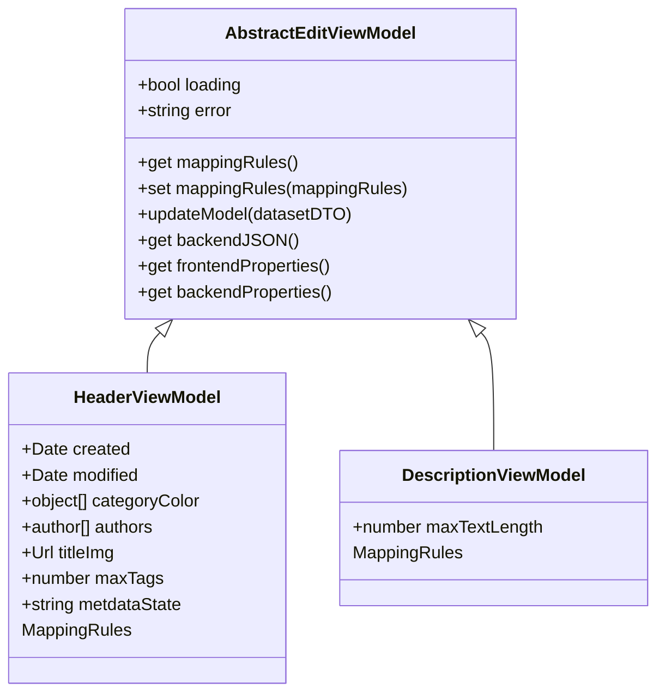

```mermaid
classDiagram
    AbstractEditViewModel <|-- HeaderViewModel
    AbstractEditViewModel <|-- DescriptionViewModel
    AbstractEditViewModel : +bool loading
    AbstractEditViewModel : +string error
    AbstractEditViewModel: +get mappingRules ()
    AbstractEditViewModel: +set mappingRules(mappingRules)
    AbstractEditViewModel: +updateModel (datasetDTO)
    AbstractEditViewModel: +get backendJSON()
    AbstractEditViewModel: +get frontendProperties()
    AbstractEditViewModel: +get backendProperties()

    class HeaderViewModel{
      +Date created
      +Date modified
      +object[] categoryColor
      +author[] authors
      +Url titleImg
      +number maxTags
      +string metdataState
      MappingRules
    }

    class DescriptionViewModel{
      +number maxTextLength
      MappingRules
    }

```
